# EduAssistant

This Android App serves two functionality -
<li>A smart Chatbot that will answer an user query in most interesting way by showing text,videos ,quiz games etc.</li>
<li>One can find the most popular topics of interest of the attendees by analysing their Github profile.</li>
 
TechnologyUsed:HP Haven On Demand API, Wikipedia API, Google YouTube API, Pandora Bots API and Android.     

## Screenshots

  &nbsp;
  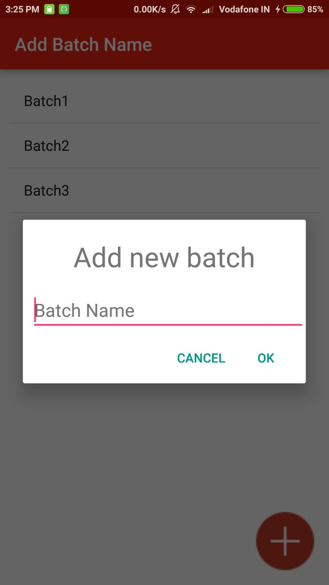&nbsp;
  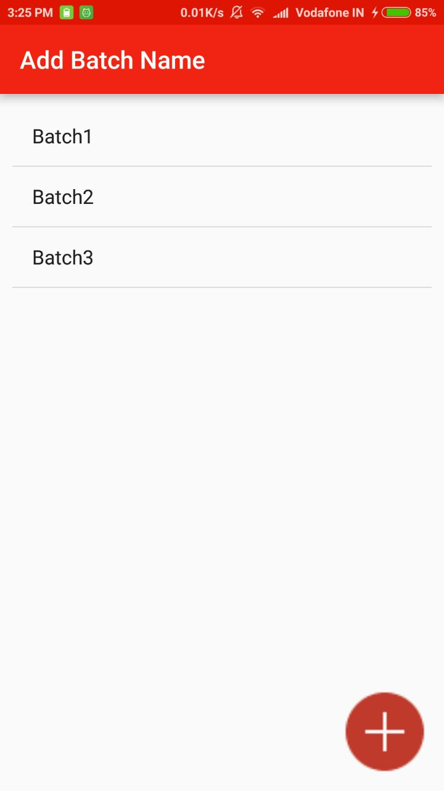

  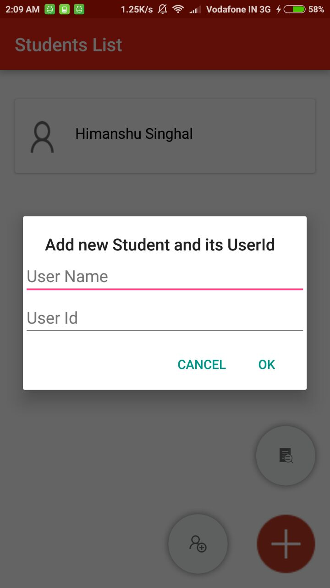&nbsp;
  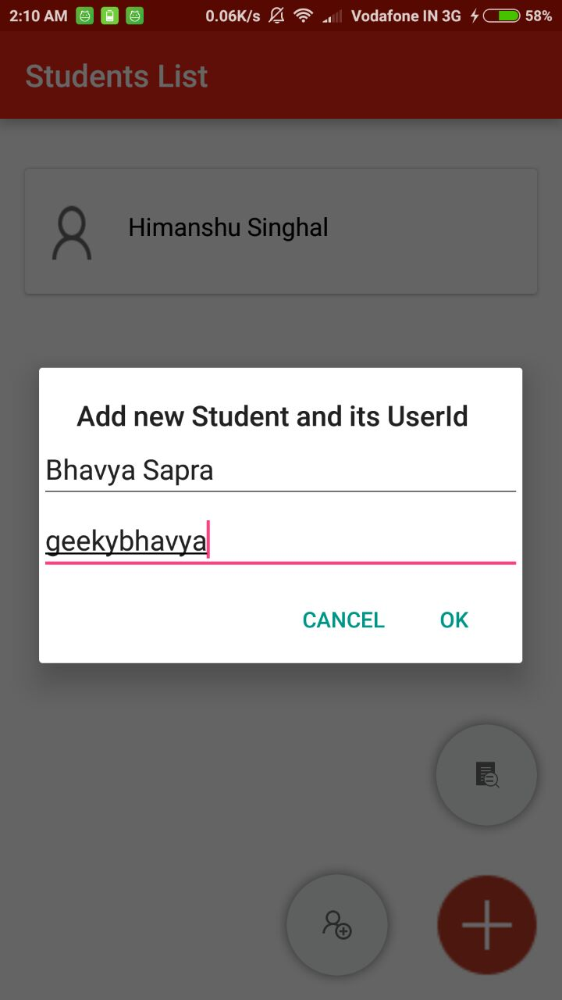&nbsp;
  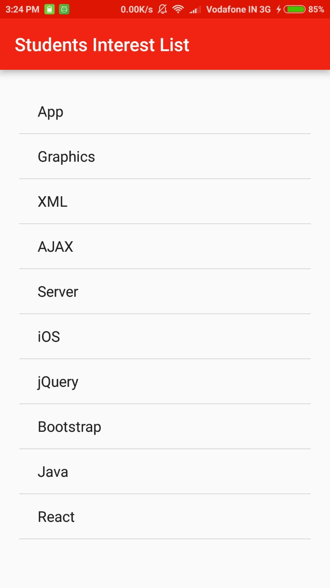

  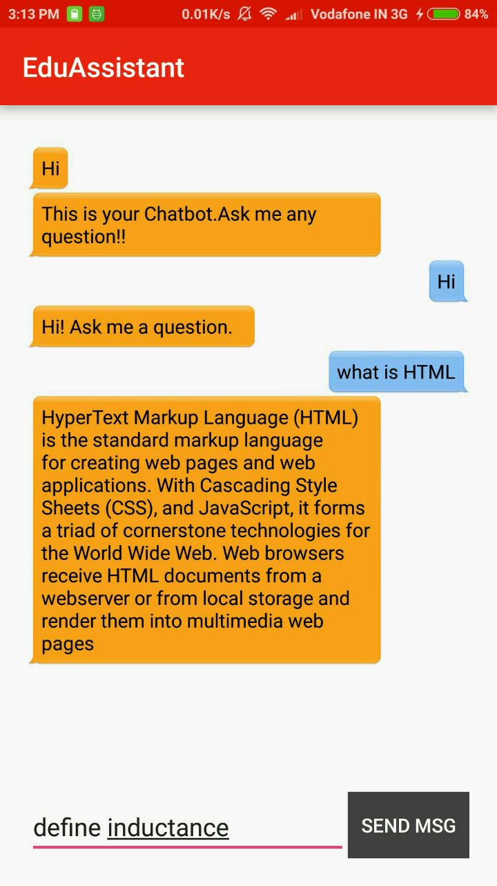&nbsp;
  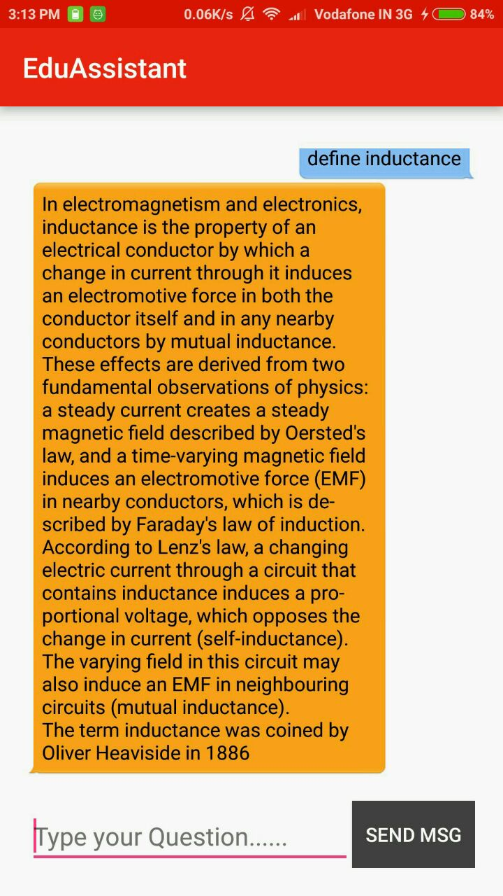&nbsp;
  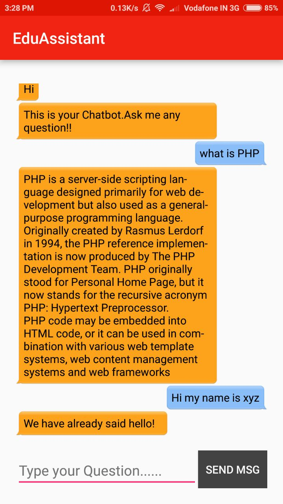

  &nbsp;
  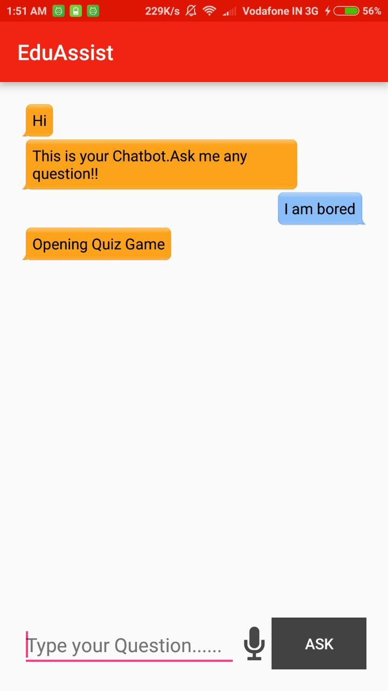&nbsp;
  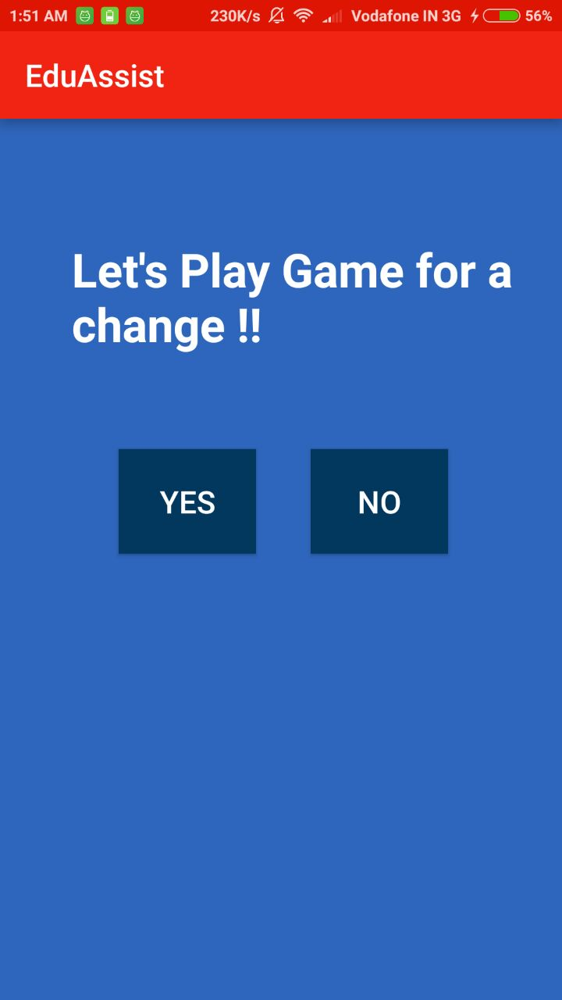&nbsp;
  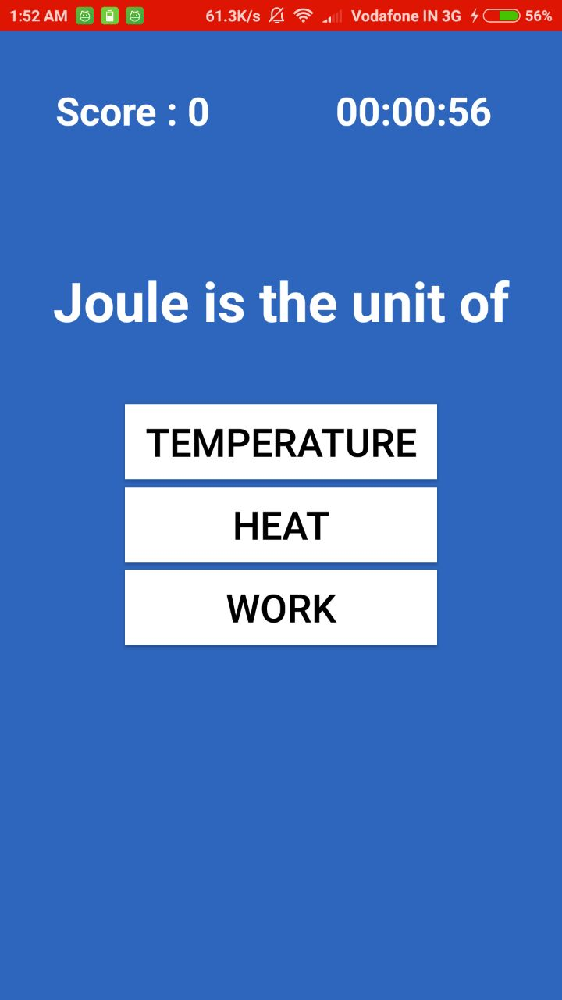&nbsp;
  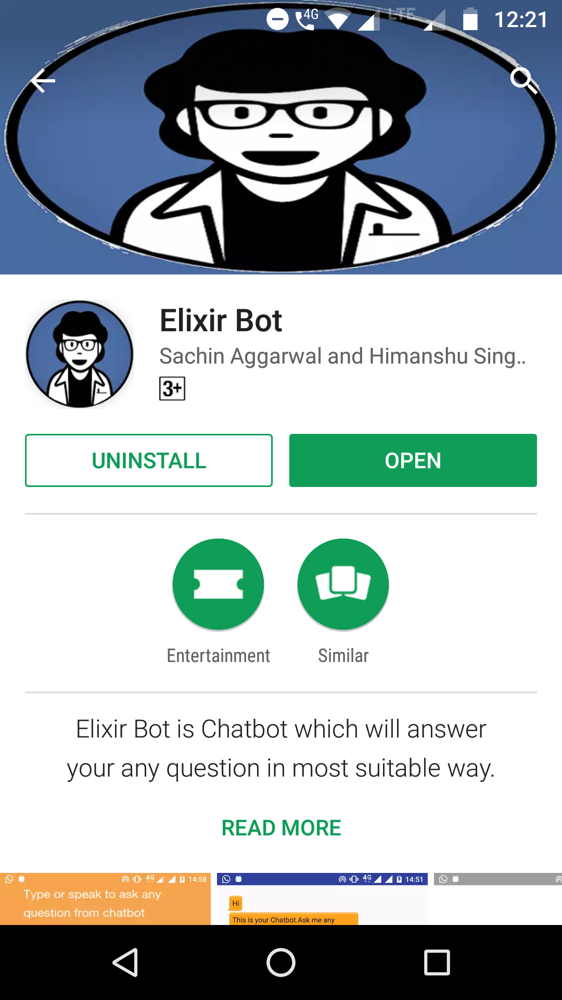&nbsp;
  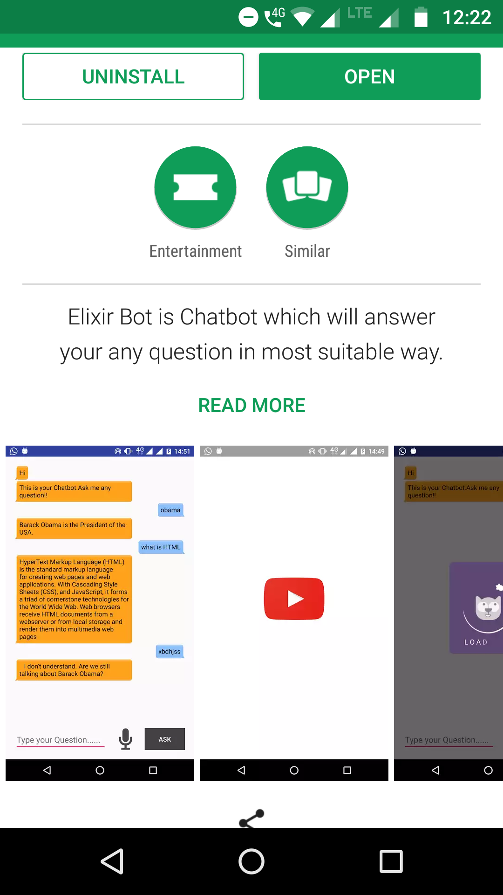&nbsp;

